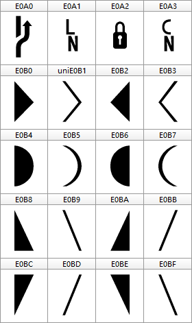

## Consolas For Powerline & YaHei Mono For Powerline

### **Introduction:**
For windows, `Consolas For Powerline` work nice with `Microsoft YaHei Mono` in vim.
(`Consolas For Powerline` is based on [consolas v5.33](https://en.wikipedia.org/wiki/Consolas))

For unix/linux, [DejaVu Sans Mono For Powerline](https://github.com/powerline/fonts/tree/master/DejaVuSansMono) is recommended.

### **Characters:**

| Codepoint  | Character                |
| :---:      | :---                     |
| `"\uE0A0"` | Branch                   |
| `"\uE0A1"` | Line number              |
| `"\uE0A2"` | Padlock (read-only)      |
| `"\uE0A3"` | Column number            |
| `"\uE0B0"` | Right angle solid        |
| `"\uE0B1"` | Right angle line         |
| `"\uE0B2"` | Left angle solid         |
| `"\uE0B3"` | Left angle line          |
| `"\uE0B4"` | Left half circle line    |
| `"\uE0B5"` | Left half circle line    |
| `"\uE0B6"` | Right half circle line   |
| `"\uE0B7"` | Right half circle line   |
| `"\uE0B8"` | Bottom-left angle solid  |
| `"\uE0B9"` | Bottom-left angle line   |
| `"\uE0BA"` | Bottom-right angle solid |
| `"\uE0BB"` | Bottom-right angle line  |
| `"\uE0BC"` | Top-left angle solid     |
| `"\uE0BD"` | Top-left angle line      |
| `"\uE0BE"` | Top-right angle solid    |
| `"\uE0BF"` | Top-right angle line     |

### **Glyphs:**

