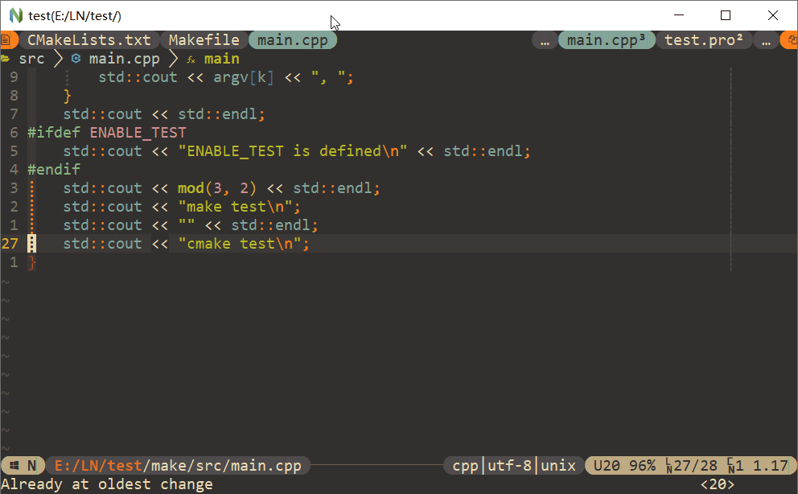
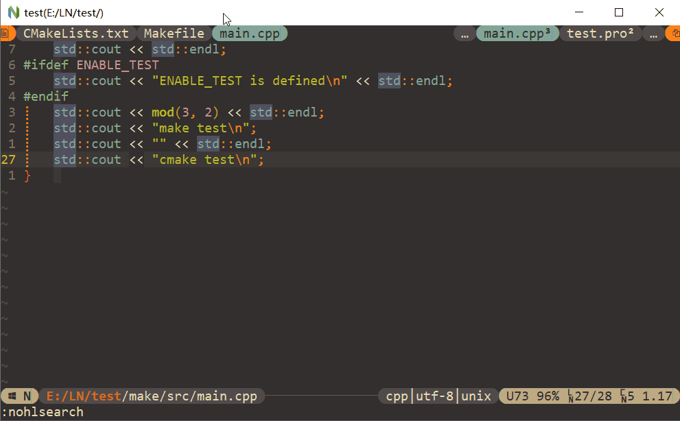

## Setup

- Linux

```sh
cd dotfiles/vim/setup
./setup_dotvim.sh
```

- Windows

```sh
cd dotfiles/vim/setup
# 首先运行disk/setup/add_envs.ps1，添加DOT_HOME和DOT_APPS等环境变量
setup_dotvim.bat
setup_link_msys64.bat
```

## dotvim

> *Code task:*

<div align="center">

</div>

> *Fzer task:*

<div align="center">

</div>


## Remote

- Start server

```sh
# Run in remote machine
nvim --headless --listen localhost:6666
# Or run in local machine via ssh
ssh -L 6666:localhost:6666 <remote machine IP> <remote machine nvim path> --headless --listen localhost:6666
```

- Connect to server

```sh
# Run in local machine
neovide --remote-tcp=localhost:6666
```


---

## Links

- [vim](https://github.com/vim/vim)
  - [GvimFullscreen](./gvim/gvimfullscreen)
- [neovim](https://github.com/neovim/neovim)
  - [nvim.appimage](https://github.com/neovim/neovim/releases/download/nightly/nvim-linux-arm64.appimage)
  - `pacman -S xclip or xsel`
- Miniconda3
  - `pip install pynvim`
- NodeJs
  - `HTTPS_PROXY=addr:port npm install -g neovim`
  - `cd dotvim/local && HTTPS_PROXY=addr:port npm install neovim`
- Git: Msys2
  - `git config --global http.proxy addr:port`
- [Ripgrep](https://github.com/BurntSushi/ripgrep)
- [Fzf](https://github.com/junegunn/fzf)
