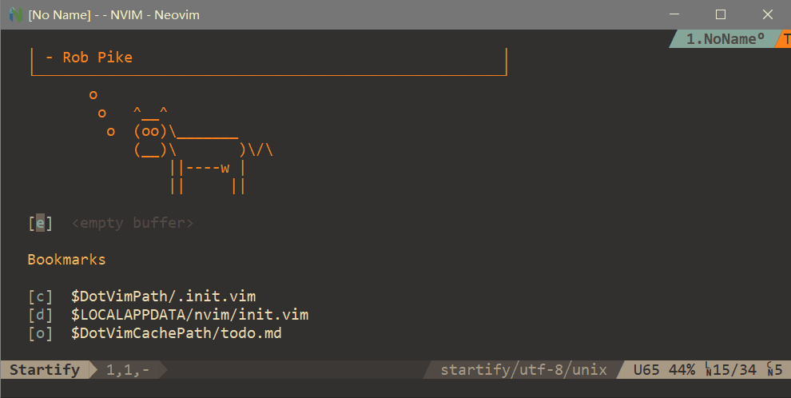
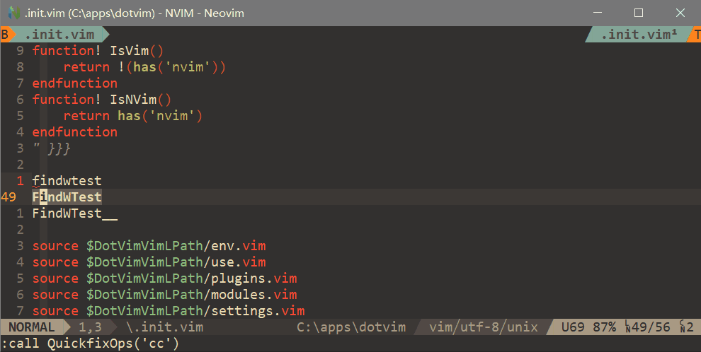

## Setup

- Linux

```sh
cd dotconfigs/vim/setup
./setup_dotvim.sh
```

- Windows

```sh
cd dotconfigs/vim/setup
# 首先运行reg/add_env_path.reg，添加APPS_HOME等环境变量
setup_dotvim.bat
setup_link_msys64.bat
```

## `.vim`

- `.vim/viml/env.vim`: 设置vim用的环境变量
- `.vim/viml/use.vim`: 设置全局`使能`变量
- `.vim/viml/pkgs.vim`: 插件加载和配置
- `.vim/viml/mods.vim`: Workspace等模块功能配置
- `.vim/viml/sets.vim`: 设置vim各种参数

> *Workspace run project:*

<div align="center">

</div>

> *Workspace find:*

<div align="center">

</div>


---

## Links

- [vim/vim](https://github.com/vim/vim)
  - [GvimFullscreen](./gvimfullscreen)
- [neovim/neovim](https://github.com/neovim/neovim)
  - `pacman -S xclip or xsel`
  - [nvim.appimage](https://github.com/neovim/neovim/releases/download/nightly/nvim.appimage)
  - [nvim-win64.zip](https://github.com/neovim/neovim/releases/download/nightly/nvim-win64.zip)
  - [neovim-qt-mingw-x64.zip](https://github.com/yehuohan/neovim-qt/releases/download/lastest/neovim-qt-mingw-x64.zip)
  - [neovim-qt-msvc-x64.zip](https://github.com/yehuohan/neovim-qt/releases/download/lastest/neovim-qt-msvc-x64.zip)
- [Python](https://www.python.org/)
  - `pip install pynvim`
- [NodeJs](https://nodejs.org)
  - `HTTPS_PROXY=addr:port npm install -g neovim`
  - `cd $DotVimPath/local && HTTPS_PROXY=addr:port npm install neovim`
- [lua](https://www.lua.org/)
- Git: [Msys2](http://www.msys2.org/) or [Cygwin](https://cygwin.com)
  - `git config --global http.proxy addr:port`
- [LLVM](http://llvm.org/) or [Clangd](https://github.com/clangd/clangd)
- [Ripgrep](https://github.com/BurntSushi/ripgrep) or [Ag](https://github.com/k-takata/the_silver_searcher-win32)
- [Fzf](https://github.com/junegunn/fzf)
- [Bat](https://github.com/sharkdp/bat)
- [Astyle](http://astyle.sourceforge.net)
- [Ctags](https://github.com/universal-ctags/ctags)
- [Lf](https://github.com/gokcehan/lf)
- [Typora](https://typora.io/)
- [MuPDF](https://www.mupdf.com)
- [SumatraPDF](https://www.sumatrapdfreader.org)


---

## FAQ

* Failed installations like vim plugins or coc extensions for permission operation on windows?

Try with administrator.

* Coc started normally but no completion?

Check worksapce folders.
